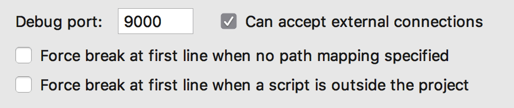

# Profiling

### What is profiling?
Profiling is dynamically analyzing the execution of a program to document performance so we can analyze opportunities for optimization.
In the context of Square 1, profiling is measuring execution time and displaying a report to understand where slow downs may have occurred. 
It is a useful tool in understanding "Do I have non-performant code?" and "What code should I focus on to increase performance?"

### How does profiling work?
XHPROF was created by Facebook and was a fairly easy tool to integrate pre php 7.
Tideways extended the project and offers an enterprise service for deeper profiling. 
Fortunately, the free tideways php extension is still capable of generating output necessary for basic profiling.

### How do I enable it?
The necessary Tideways container is configured as part of the global Square 1 docker-compose.
To enable it in your project:
* activate the wp-tideways-profiler plugin
* in your local-config: define( 'WP_DEBUG', true );
* in your local-config: define( 'SQUARE1_XHPROF', true );

(in PHP Storm you'll want to disable 'Force break...' Languges & Frameworks > PHP > Debug)

### How do I use it?
At the bottom of every page a link is added (during the `shutdown` hook). If you don't see the link, view source.

### How do I read this output?
`Function Name` The name of the function called.\
`Calls` How many times it was called.\
`Calls%` What percent of the total function calls were this function.\
`Incl. Wall Time` The total execution time of this functions calls in ms INCLUDING any functions called within.\
`IWall%` What percent of the total execution path happened within this function inclusive of children.\
`Excl. Wall Time` The total execution time this functions calls in ms EXCLUDING any functions called within.\
`EWall%` What percent of the total execution path happened within this function exclusive of children.\