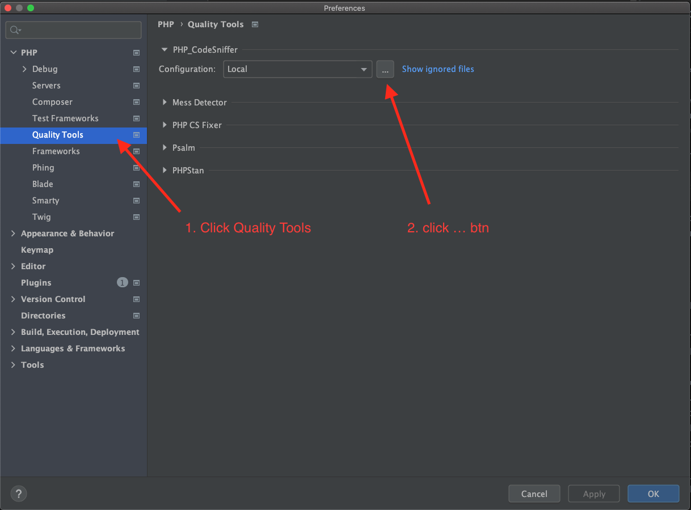
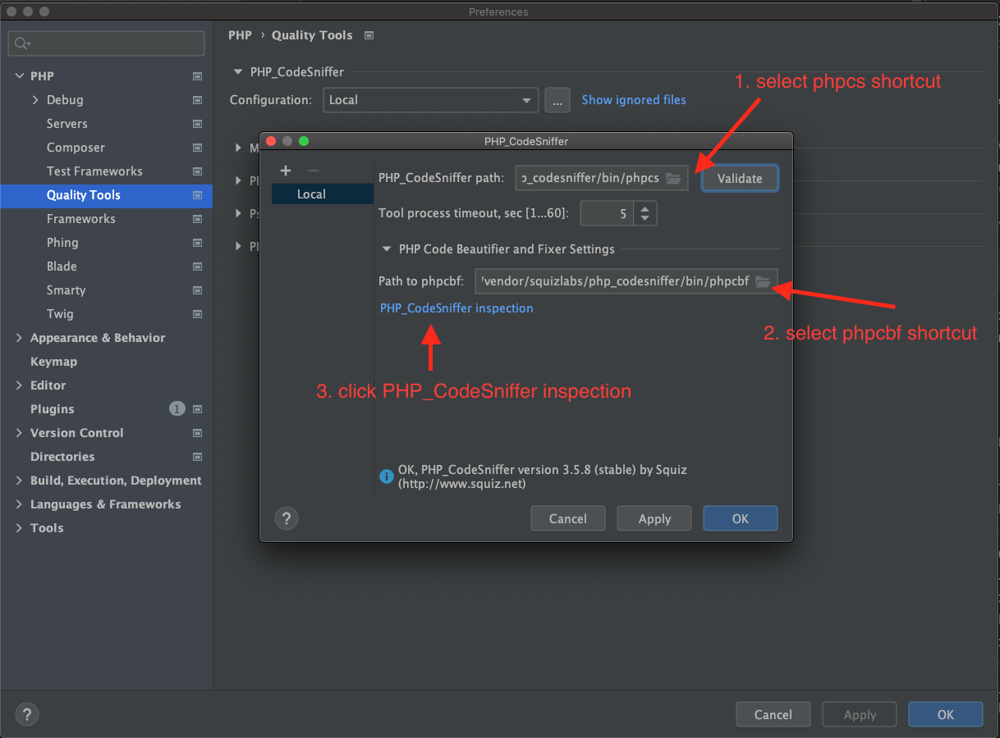
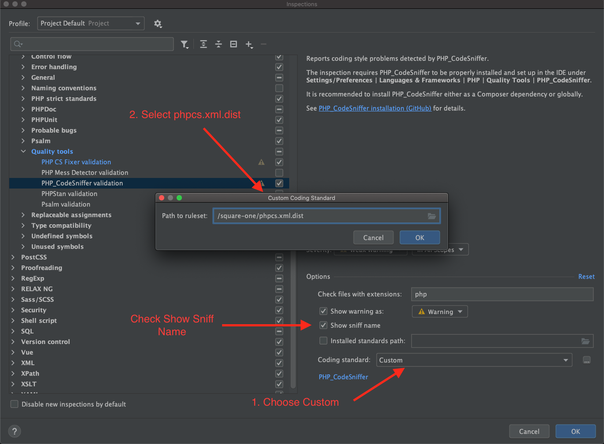
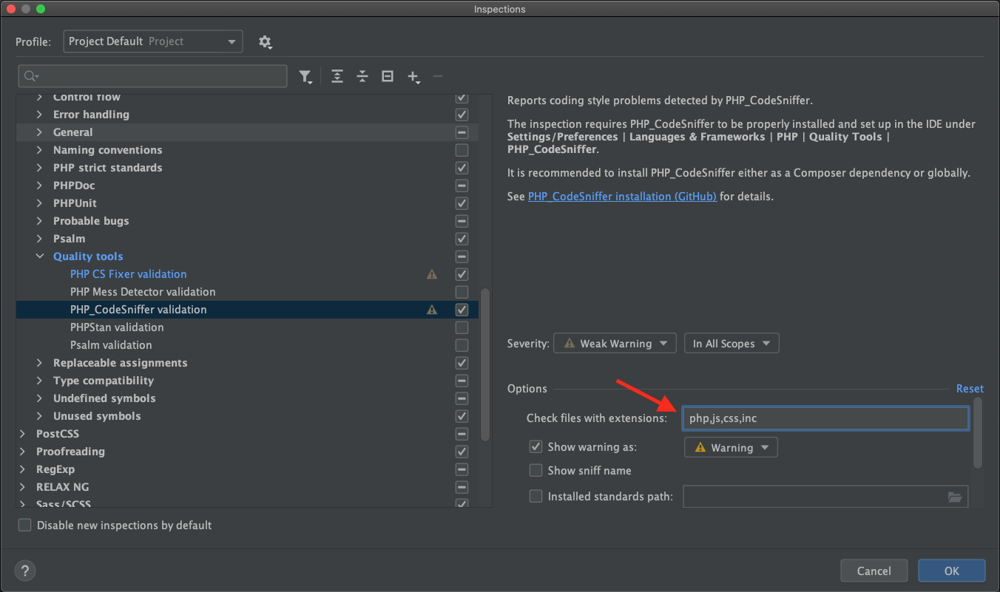

# PHPCS

PHP Code Sniffing is the process of evaluating code formatting in an IDE to verify that all developers are using the same syntax and style. At Tribe, this keeps us all on the same page and makes sure that we're all conforming to the same coding standards and best practices.

Whether you're using PhpStorm, VS Code, or another IDE, everyone needs to know how to get PHPCS running correctly to enforce a consistent coding style. Reviewing consistently formatted code helps reduce the cognitive load of peer reviews.

## Visual Studio Code (VS Code)
Download and enable the [PHP Sniffer & Beautifier](https://marketplace.visualstudio.com/items?itemName=ValeryanM.vscode-phpsab)

SquareOne installs PHPCS on a per-project basis, so there is no need to install PHPCS globally. If you install it globally, know that you'll need to make sure your executable is following the correct phpcs.xml found in your project's root.

If you're using the plugin linked above, you shouldn't need to worry about global vs. local. It is smart enough to look at the `composer.json` to determine if it should use the project's phpcs or your global executable. The default settings work with our coding standards out-of-the-box. Be sure that you don't have any conflicting settings listed in your local `settings.json` that may be left behind from unused extensions.

One configuration you'll probably want to include in your `settings.json` is
```js
"phpcs.showSources": true
```
This setting will display the exact ruleset being used to highlight an error in your IDE and will help you determine what the issue is.

## PhpStorm

1. In the Settings/Preferences, navigate to PHP | Quality Tools.



2. On the Quality Tools page that opens, expand the PHP_CodeSniffer area and click the Browse button next to the Configuration list.

3. In the PHP_CodeSniffer dialog that opens, go to: `project-folder/vendor/bin/`

4. Select `phpcs` shortcut file then press Validate.

5. Open the PHP Code Beutifier and Fixer settings and in the same folder select `phpcbf` shortcut file.

6. Click the PHP_CodeSniffer inspection link



7. In the new dialogue box that opens make sure the PHP_Codesniffer validation is checked. 

8. In options section scroll to the coding standard dropdown and pick `custom`

9. click the `...` button to open a dialogue box to select the `phpcs.xml.dist` in the root of the project directory



10. Make sure only php files are checked, by deleting the js,css extensions.



## Make sure project won't commit with errors

[Detailed instructions on how to set this up are found here](https://github.com/moderntribe/square-one/blob/main/docs/tooling/git-hooks.md#automatic-git-hooks
)
